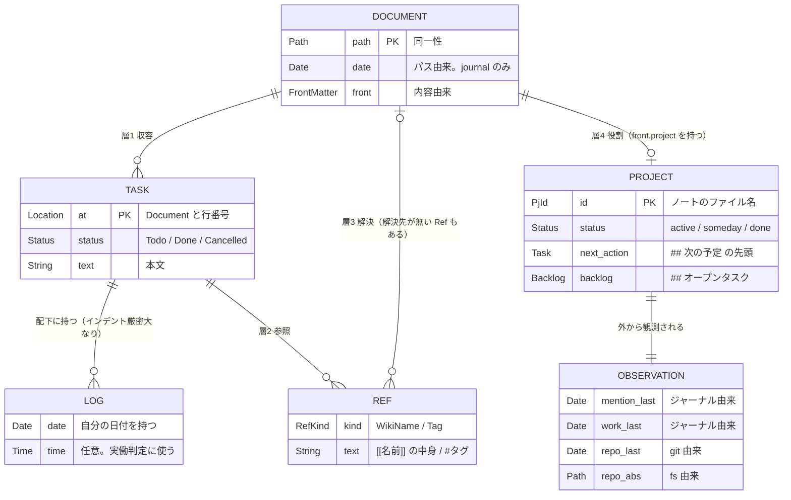
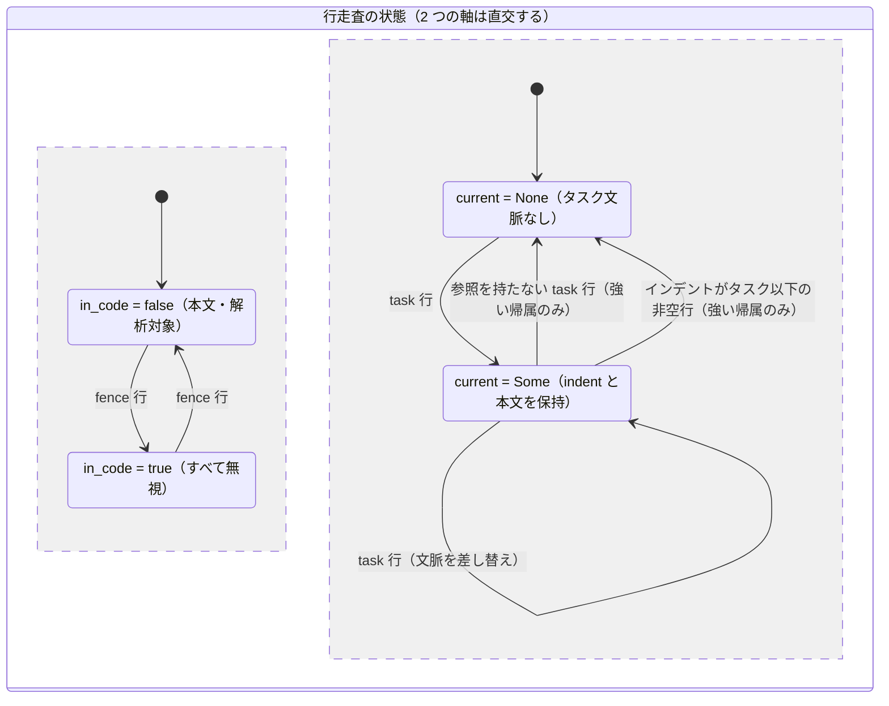
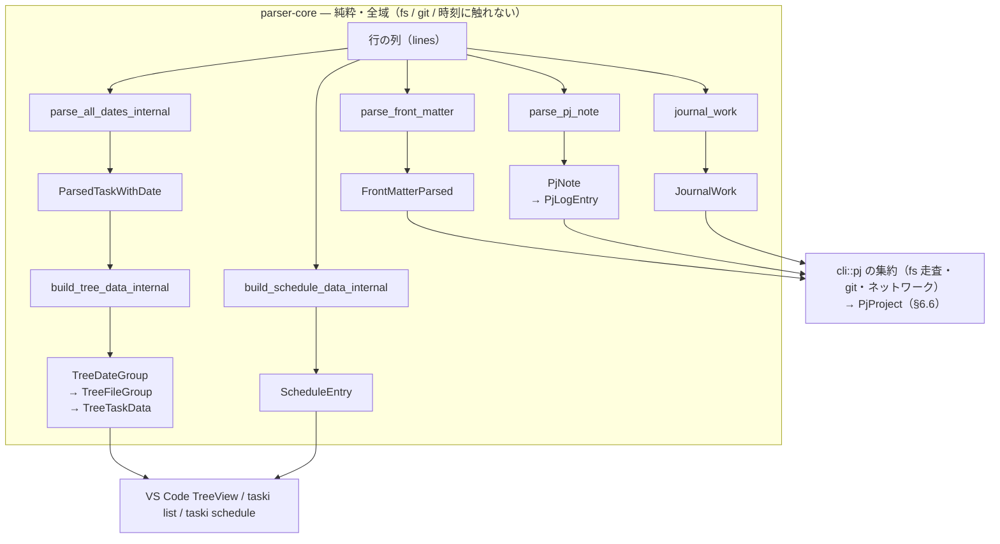
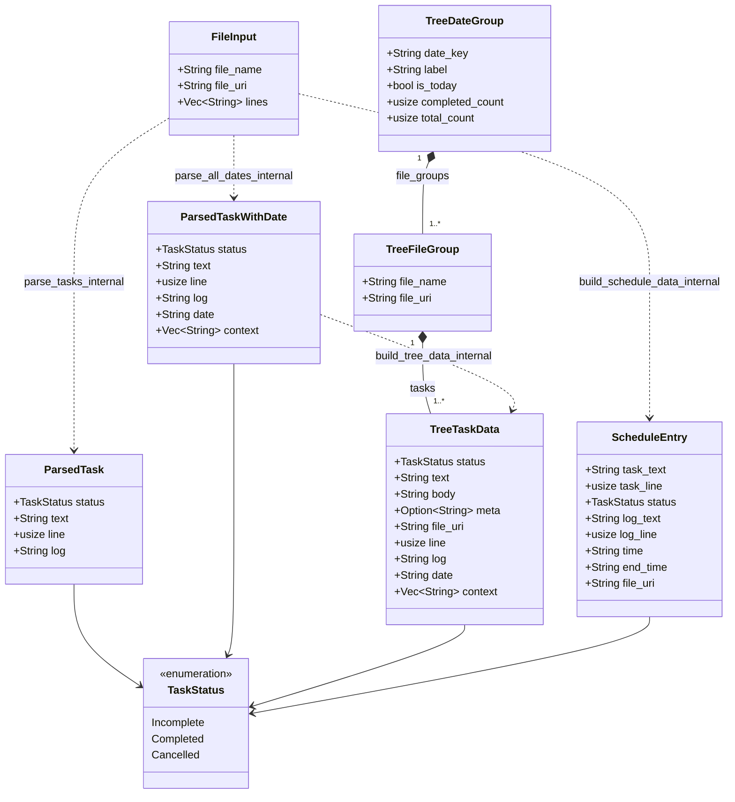
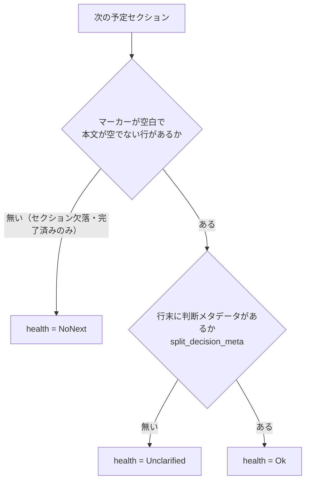
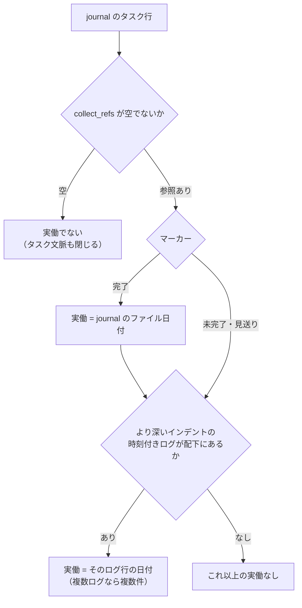
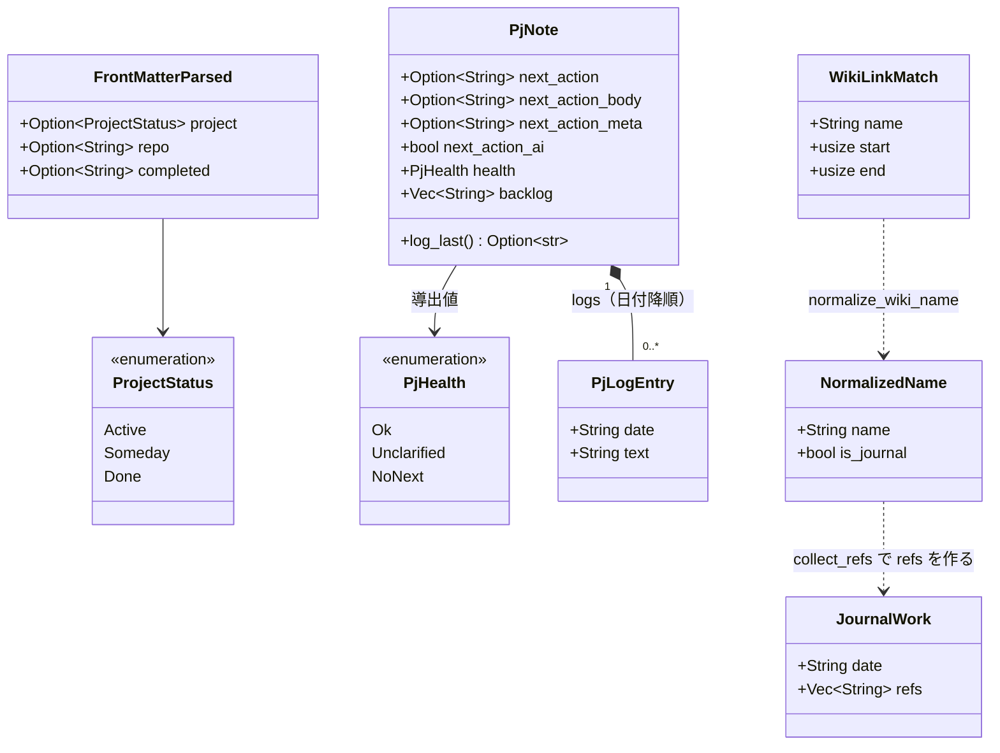
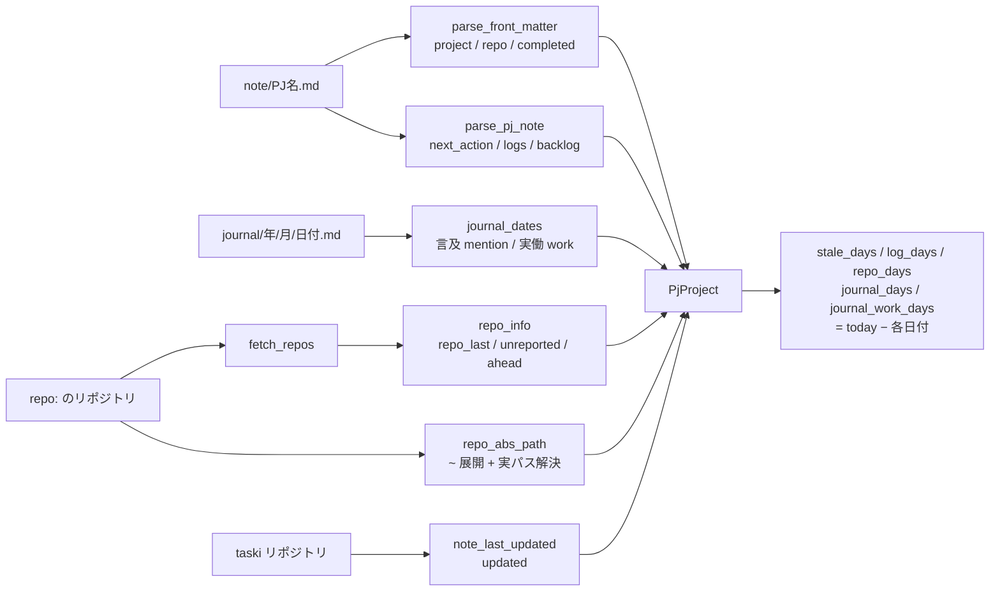
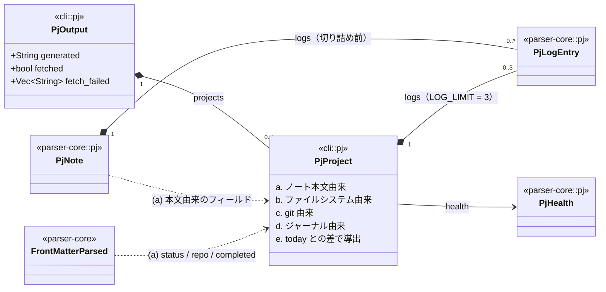
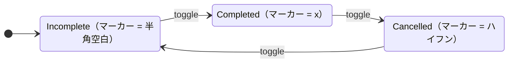

# taski 設計 — ドメインモデル

本ドキュメントは taski のドメインを形式的に記述する。

- **[requirements.md](requirements.md)** — *何を* 満たすか（要求）
- **[architecture.md](architecture.md)** — *どこに* 置くか（クレート構成・パイプライン・ビルド）
- **本ドキュメント** — *どう表すか*（概念・型・不変条件・写像・事前条件）

要求の根拠（なぜその仕様なのか）は requirements.md 側にある。ここでは要求を型と述語に落とした結果だけを扱い、根拠は重複させない。

**目標と現状を分けて書く。**

| 章 | 立場 |
| --- | --- |
| §2 概念モデル | **目標形。** ドメインに何があり、どう関係するか |
| §3〜§9 | **現状。** 実装されている構文・走査・型・不変条件・写像 |
| §10 既知の弱さ | 型で守れていないが、そう決めたもの（W-*） |
| §11 移行課題 | 概念とずれているので、いずれ直すもの（G-*） |

§2 だけが実装より先を書いている。現状の記述（§3 以降）と食い違う箇所は、すべて §11 に対応する G-* がある。

## 1. 設計原則

**P1. 解析は全域かつ純粋な写像である。**
`parser-core` は入力 `Vec<String>`（行の列）から出力データ構造への写像だけを担う。ファイルシステム・git・時刻・環境変数に触れない。任意の入力に対して停止し、パニックせず、値を返す（例外は §8 の事前条件のみ）。これにより VS Code 拡張（WASM 経由）と CLI（直接リンク）で同じ入力から同じ出力が出ることが型レベルで保証される。

**P2. 副作用は `cli` に閉じる。**
git の呼び出し・ディレクトリ走査・並列 fetch・現在日付の取得は `cli/src/pj.rs` に置く。`parser-core` の関数は「基準日」「ファイルの日付」を **引数で受け取る**（`journal_work(lines, file_date)`, `build_tree_data_internal(files, today_str)`）。テストが時刻に依存しないのはこの分割の帰結である。

**P3. 事実と判断を型で分ける。**
`PjProject` が持つのは機械的に決まる事実（日付・件数・有無）だけで、「着手すべきか」「粒度が粗いか」は含めない。唯一の例外が `PjHealth` で、これは §7 I-11 のとおり他フィールドから決定的に導出される要約であり、独立した判断ではない。

**P4. 同じ概念は 1 つの関数から出す。**
参照の抽出（`collect_refs`）、判断メタデータの分離（`split_decision_meta`）は言及側・実働側・`list` 側で同一の関数を共有する。片方だけが表記の揺れを拾うと、§7 I-17 のような不変条件が壊れる。

**P5. 境界（WASM / JSON）を通る型は素直な表現に寄せる。**
`serde` の既定表現で往復できることを優先し、newtype やタグ付き列挙を境界型には持ち込まない。その代償として本来は直和である概念が「フラットな構造体＋空文字列の判別子」に潰れている箇所がある（§6.3・§10）。潰した箇所は必ず本ドキュメントで代数的な形を併記する。

## 2. 概念モデル（目標形）

この章は **taski のドメインがどうあるべきか** を書く。現状の Rust の型（§6）とは一致しない箇所があり、差分は §11 に移行課題として列挙する。実装より先に「何が何であるか」を固定するために置いている。

### 2.1 エンティティ

ドメインは 3 つの実体（`Document` / `Task` / `Log`）と、それらを結ぶ参照 `Ref` からなる。

```
Document                          -- md ファイル 1 つ。一次情報はすべてここにある
  ├ path  : Path                  -- 同一性
  ├ date  : Option<Date>          -- パスから決まる（journal/<Y>/<M>/<YYYY-MM-DD>.md）
  ├ front : Option<FrontMatter>   -- 内容から決まる
  └ lines : [Line]

Task                              -- Document 内のチェックボックス行
  ├ at     : (Document, Line)     -- 同一性。どの Document に収容されているかを含む
  ├ status : Todo | Done | Cancelled
  ├ text   : String
  ├ logs   : [Log]
  └ refs   : Set<Ref>             -- 参照。§2.3。Task は Project を知らない

Ref                               -- 文中に書かれた参照
  = WikiName(String)              -- [[名前]]
  | Tag(String)                   -- #タグ

Log                               -- Task に帰属する日付付きの記録
  ├ at   : (Document, Line)
  ├ date : Date
  ├ time : Option<Time>           -- 実働判定はこの有無で決まる（§2.5）
  └ text : String
```

**Document の性質は独立した 2 つの軸で決まる。**

| 軸 | 由来 | 与えるもの |
| --- | --- | --- |
| `date` | **パス**が `journal/**/<YYYY-MM-DD>.md` に一致するか | その Document に書かれた記録の既定の日付 |
| `front` | **内容**（先頭の YAML front matter） | PJ かどうか（§2.2）、`repo` / `completed` |

この 2 つを 1 つの直和（`Journal | Note | Other`）に潰してはならない。潰すと「`journal/` に置いたか」と「`project:` を書いたか」が同じ次元の判定に見えるが、前者はパスの規約、後者はファイルの中身であり、独立に決まる。

**`note/` は概念に登場しない。** 参照の作成先の既定（§2.4）というだけの規約であって、Document の種類ではない。

日付の由来はもう 1 つある — 文書内の `# YYYY-MM-DD` 見出し。これは Document の属性ではなく走査中のカーソル（§5）であり、`Document.date` とは別物として扱う。

### 2.2 Project は Document の役割である

```
Project ⊂ Document
  条件: front.project = Some(status)
  id  : PjId = path.file_stem()
```

**Project は Document を所有する別の実体ではなく、Document の部分集合である。** `status` / `repo` / `completed` / 次の予定 / ログ / バックログは、すべてそのノート本文から読める。Project 固有の状態は存在しない。

一方 `journal_last` / `repo_last` / `updated` / `ahead_count` は Project の性質ではない。**Project に対して外から行った観測**である。

```
Observation(pj) = ジャーナル由来（§2.5）∪ git 由来 ∪ ファイルシステム由来
```

出力型 `PjProject`（§6.6）が持つ 5 つの層は、この区別に対応している。

| 層 | 概念 | 例 |
| --- | --- | --- |
| a | Project（ノート本文） | `status` `next_action` `logs` `backlog` |
| b | Observation / fs | `repo_abs` |
| c | Observation / git | `updated` `repo_last` `ahead_count` |
| d | Observation / ジャーナル | `journal_last` `journal_work_last` |
| e | 導出（`today` との差） | `stale_days` `log_days` `unreported` |

**定義と観測の分離は P3（事実と判断を分ける）の 1 つ下の層にある規律である。** 定義はノートを書き換えれば変わる。観測は世界を見に行かないと変わらない。両者を 1 つの構造体に平坦化するのは出力の都合であって、概念としては別に扱う。

### 2.3 関係の層 — Task は Project を知らない

**「Task が PJ に属する」は基本関係ではない。** Task が直接持つ関係は 2 つだけで、Project に届くのはそこから 2 段先である。

| 層 | 関係 | 意味 | 現状の実装 |
| --- | --- | --- | --- |
| 1 | Task → Document | **収容**。どの文書に書かれているか。`task.at` の一部であり、独立した関係ではなく同一性そのもの | `FileInput.file_uri` + `line` |
| 2 | Task → Ref | **参照**。行から `[[名前]]` / `#タグ` を抽出する | `pj::collect_refs` |
| 3 | Ref → Document | **解決**。その名前がどの文書を指すか。解決先が無い `Ref` は普通にある（`#買い物`） | `wiki_link::resolve_wiki_link` |
| 4 | Document → Project | **役割**。`front.project` を持つか（§2.2） | `parse_front_matter` |

PJ 軸はこの合成として導出する。

```
docs(task)     = { task.at.0 } ∪ { d | r ∈ task.refs, resolve(r) = Some(d) }   -- 層 1・2・3
projects(task) = { d ∈ docs(task) | d ∈ Project }                              -- 層 4
```

1 つの Task が複数の Project に属してよい（N:M）。

**層を分ける理由は、PJ を経由しないビューが実在するからである。** タグ別ビューは層 1・2 だけで成立する。

```
tags(task) = { r ∈ task.refs | r は Tag } ∪ { name(task.at.0) }
```

これは `extract_tags` と `extract_file_tags` の合成そのもので、Project の概念を一切要求しない。一方 `taski pj` は層 3・4 を通る。**両者が別世界を見ているように見えるのは、別の層の合成を見ているからであって、同じ概念が分裂しているからではない。**（実際に分裂しているのは層 3 だけ — §11 G-5）

**層をまたいだ依存を持ち込まない。** 現状の `extract_file_tags` は層 1 のタグ導出でありながら `project: active` を条件にしており、層 4 の情報を見ている。「どの PJ か」（事実）に「表示するか」（判断）が混入した形である。タグ導出は層 1・2 で完結させ、`status` による絞り込みは表示側の責務とする（§11 G-1）。

`## 次の予定` の特別扱いも関係ではない。**Project ノート内での役割**であり、層とは直交する軸である。

```
next_action(pj) = 「## 次の予定」セクションにある最初の未完了 Task
```

つまり `next_action` は Task であって文字列ではない。位置を持つので、そこへ飛べる（現状は持っていない — §11 G-3）。

なお本ドキュメントで**「帰属」と呼ぶのは Log と Task の関係（§5）だけ**である。Task と Project の間にあるのは上の 4 層とその合成であって、帰属ではない。

### 2.4 同一性 — PjId と参照の解決

Project の正規名 `PjId` はノートのファイル名（拡張子を除いた stem）とする。参照は 2 つの表記で書かれる。

| 表記 | 例 | 空白 |
| --- | --- | --- |
| `[[名前]]` | `[[在庫 管理]]` | 書ける |
| `#タグ` | `#在庫_管理` | 書けない（`_` で代用する） |

したがって照合は正規形どうしの比較ではなく、**照合キー**を経由する。

```
match_key(s) = s の空白を "_" に置換したもの
pj ∋ ref  ⟺  match_key(id(pj)) = match_key(ref)
```

`match_key` は単射ではない（`在庫 管理` と `在庫_管理` が衝突する）。これは `#タグ` に空白を書けないという表層構文の制約から来る本質的な非可逆性なので、**衝突を禁止する側で解く**。すなわち PJ ノートの `match_key` は一意でなければならない。こう決めると曖昧さが「黙って片方を採る」ではなく「入力が不正」として表面化する。

**参照の解決は 1 つの関数に集約する。**

```
resolve(ref, docs) : Option<Document>
```

Wiki リンクを開く時と PJ を照合する時で、同じ `resolve` を通す。Project かどうかは、解決した Document の `front` を見て決める。この形にすると「`note/` 直下にあるか」は概念から消え、探索範囲の設定という実装事項に退く（現状は 2 系統に分かれている — §11 G-5）。

### 2.5 観測値の導出

ジャーナル由来の観測は、ジャーナルを直接読むのではなく **Task 集合からの導出**として定義する。

```
Journals = { d ∈ Document | d.date ≠ None }
hits(pj, R) = ∃ r ∈ R. match_key(id(pj)) = match_key(text(r))     -- §2.4

mention(pj) = max { d.date | d ∈ Journals, hits(pj, refs(d の全文)) }
work(pj)    = max { w      | d ∈ Journals, t ∈ Tasks(d), hits(pj, t.refs), w ∈ worked(t) }

worked(t)   = { d.date   | t.status = Done }
            ∪ { log.date | log ∈ t.logs, log.time ≠ None }
```

- 時刻の無いログは実働にしない。ジャーナルでは「やった記録」ではなく予定・メモとしても書かれるため。
- `max` を採る（走査順に依存させない）。時刻付きログは自分の日付を持つので、新しいジャーナルに前日ぶんを書き足せる。
- 観測範囲を `Journals` に限る。Project ノート自身の `## ログ` は `log_last` が担当する別の観測である。

**両者とも §2.3 の層 2（参照）だけを使い、層 1（収容）にも層 4（役割）にも触れない。** 違いは参照を集める範囲だけで、言及は文書全体、実働はタスク行に限る。

**この定義のもとで「実働 ⊆ 言及」は定理になる。** タスク行は文書の一部なので `t.refs ⊆ refs(d の全文)`、したがって `hits(pj, t.refs) ⟹ hits(pj, refs(d の全文))`、すなわち `work(pj) ≠ ⊥ ⟹ mention(pj) ≠ ⊥`。集合の包含から従うだけで、PJ の概念も収容経路も出てこない。現状はこれを**規律**（両者で同じ `collect_refs` を呼ぶ）で守っており、破れうるので §7 I-17 に不変条件として書いてある。導出に直せば規律が不要になる（§11 G-4）。

### 2.6 全体図



読み方:

- **`TASK` から `PROJECT` への辺は無い。** 層 2 → 3 → 4 を辿って初めて届く（§2.3）。タグ別ビューは層 2 で止まるので、この図の右半分を必要としない。
- `PROJECT` の箱は独立したレコードではなく **`DOCUMENT` の役割**である（§2.2）。`DOCUMENT` から出る辺が 2 本（層 1 と層 4）あるのはそのためで、層 3 の解決先として戻ってくる辺も同じ `DOCUMENT` である。
- `OBSERVATION` も保存される実体ではなく、実行のたびに世界を見て作られる値である。`PROJECT` とは「概念としては別だが、出力では 1 つの構造体に平坦化される」関係にある。

## 3. ドメインの語彙

| 記号 | 定義 | Rust 表現 |
| --- | --- | --- |
| `Date` | `YYYY-MM-DD` の暦日。辞書順 = 日付順 | `String` |
| `Time` | `HH:MM`（正規化後は必ず 2 桁時） | `String` |
| `Indent` | 行頭空白の幅。**バイト数**で数え、タブは 1 とする | `usize` |
| `Name` | Wiki リンクの正規化名（`.md` を落とし前後を trim した文字列） | `String` |
| `Tag` | `#` に続く空白と `#` を含まない文字列 | `String` |
| `Ref` | `Name` ∪ `Tag`。PJ への参照（照合は §2.4） | `String` |
| `PjId` | PJ の正規名 = ノートのファイル名。§2.4 の目標であり、現状は型として存在しない（§11 G-2） | （なし） |
| `Line` | 行番号。**`parser-core` は 0 始まり**、CLI の `toggle` 引数は 1 始まり | `usize` |

`Indent` の数え方は 2 箇所（正規表現の `^(\s*)` のキャプチャ長と `pj::indent_width`）で独立に実装されているため、**両者が同じ数え方であることが不変条件**である（`indent_width` は `line.len() - line.trim_start().len()` でバイト数を返す）。片方を文字数に変えるとタブ混在時に帰属判定がずれる。

## 4. 表層構文（行の文法）

解析は行単位で、行の種別は次の文法で決まる。`digit` は ASCII 数字、`sp` は空白 1 文字。

```ebnf
line       = fence | heading | task | log | time_memo | other ;

fence      = indent , ( "```" | "~~~" ) , … ;
heading    = "#" × 1..6 , sp+ , text ;
task       = indent , "-" , sp* , "[" , marker , "]" , sp* , text ;
marker     = " " | "x" | "-" ;
log        = indent , "-" , sp* , date , [ sp+ , time , [ "-" , time ] ] , ":" , sp* , text ;
time_memo  = "-" , sp , time , ":" , sp , text ;          (* インデント不可・トップレベルのみ *)

date       = digit × 4 , "-" , digit × 2 , "-" , digit × 2 ;
time       = digit × 1..2 , ":" , digit × 2 ;
indent     = { " " | "\t" } ;
```

構文上の要点:

- `task` の `marker` は 1 文字の `[ x-]` に限る。したがって `- [[ノート名]]` は `[` の次が `[` なので `task` に**一致しない**。これは偶然ではなく要求（requirements.md 2.3）であり、正規表現を緩めてはならない。
- `log` の時刻部は省略可能で、`log` は「時刻なしログ」と「時刻付きログ」を包含する。実働判定（§6.5）だけが `timed_log`（時刻部を必須にした狭い文法）を使う。
- `time_memo` は行頭に空白を許さない。ジャーナルのトップレベル時刻メモだけを拾うためで、タスク配下のログと衝突させないための構文的な区別である。
- `fence` は開始・終了を区別せず、一致するたびにフラグを反転させる。言語指定付きの開始行（```` ```rust ````）も同じ規則で拾える。フェンス内の行はすべての解析から除外される。

## 5. 走査のセマンティクス（タスク文脈）

すべての行走査は次の状態機械で表せる。

```
State = { in_code : bool
        , current : Option<TaskCtx>
        , heads   : Vec<String>        -- parse_all_dates_internal のみ
        }
TaskCtx = { indent : Indent, status : TaskStatus, text : String, line : Line, context : Vec<String> }
```

`in_code` と `current` は**直交する**。フェンス行は `in_code` を反転させるだけで `current` を捨てないので、タスクの配下にコードブロックを挟んでもログの帰属は切れない。



遷移規則（上から順に最初に一致したものを適用する）:

| # | 入力行 | 遷移 |
| --- | --- | --- |
| R1 | `fence` | `in_code ← ¬in_code`、出力なし |
| R2 | `in_code = true` | 無視 |
| R3 | `heading(level, t)` | `heads ← heads[0..level-1] ++ [t]`（`current` は保持） |
| R4 | `task(i, m, t)` | `current ← Some(TaskCtx{ indent: i, .. })` |
| R5 | `log(i, d, s)` かつ `current = Some(c)` かつ `i > c.indent` | 出力を 1 件生成 |
| R6 | その他 | `current` を保持（弱い帰属） / 条件付きで `current ← None`（強い帰属） |

**帰属規則が 2 種類ある**ことが、このドメインで最も間違えやすい点である。

- **弱い帰属**（`parse_tasks_internal` / `parse_all_dates_internal` / `parse_schedule_internal`）: ログはインデントが厳密に深いという条件だけで直前のタスクに帰属する。間に見出しや段落が挟まっても文脈は閉じない。タスクとログが素直に隣接する通常のノートを対象にした緩い規則。
- **強い帰属**（`pj::journal_work`）: 上に加えて、**空でない行のインデントがタスク以下になった時点で `current ← None`**。空行だけでは閉じない。ジャーナルは `## 今日の候補` に PJ を並べ、別の場所に無関係な時刻メモを書く形が普通なので、弱い帰属のままだと「候補に載せただけ」が実働に化ける（requirements.md 6.1）。

`≥` ではなく `>`（厳密大なり）である点も規則として固定である。同じインデントの `- 2026-08-02: ...` はタスクの兄弟であってログではない。

## 6. Rust ドメインモデル（現状の型）

ここからは**実装されている型**を記述する。§2 の概念（Document / Project / Task / Log / Observation）と 1 対 1 には対応していない。対応と差分は §11 にまとめてある。

型の全体像と、P1・P2 が引いている純粋／副作用の境界:



`parser-core` 側の矢印はすべて**関数適用**であり、外部状態を経由しない。`cli` 側の箱だけがファイルシステム・git・ネットワークに触れる。基準日（`today`）もこの境界を越えて引数として渡される。

### 6.1 状態の代数

```rust
enum TaskStatus  { Incomplete, Completed, Cancelled }   // parser-core
enum ProjectStatus { Active, Someday, Done }            // parser-core（front matter）
enum PjHealth    { Ok, Unclarified, NoNext }            // parser-core::pj（導出値）
```

`TaskStatus` は `marker` との全単射である。

```
' ' ↔ Incomplete    'x' ↔ Completed    '-' ↔ Cancelled
```

`TaskStatus::from_marker` は全域関数として書かれている（未知の文字は `Incomplete`）が、呼び出し側は必ず `[ x-]` にキャプチャされた 1 文字を渡すため、実際に到達するのは上の 3 対応だけである。

3 状態は「対応の要否」と「完了したか」という 2 つの軸を 1 つの型に畳んだもので、集計の際は軸ごとに使い分ける。

| 用途 | Incomplete | Completed | Cancelled |
| --- | --- | --- | --- |
| 進捗の分母（`total_count`） | 含む | 含む | **含まない**（中立） |
| 進捗の分子（`completed_count`） | — | 含む | — |
| 今日以外の日付グループ | 表示 | 非表示 | 非表示 |
| 実働判定（§6.5） | — | 実働 | **実働でない** |

### 6.2 タスク（`parser-core`）

```rust
struct ParsedTask {                    // parse_tasks_internal の出力（日付を指定して抽出）
    status: TaskStatus, text: String, line: Line, log: String,
}

struct ParsedTaskWithDate {            // parse_all_dates_internal の出力
    status: TaskStatus, text: String, line: Line, log: String,
    date: String,                      // ← 本来は Option<Date>
    context: Vec<String>,              // 祖先見出しのスタック
}
```

`ParsedTaskWithDate` は「タスク × その日のログ」の直積であって、タスクそのものではない。1 つのタスク行が n 件のログを持てば n 個の値が生成される。**ログを 1 件も持たないタスクだけが `date = ""` の値を 1 個生成する。** 本来の代数は

```rust
enum Dated { NoDate, On(Date) }
```

だが、WASM 境界を素直に通すために空文字列で符号化している（P5）。判別子は `date.is_empty()`。

### 6.3 ツリーとスケジュール（`parser-core`）

```rust
struct FileInput { file_name: String, file_uri: String, lines: Vec<String> }   // 唯一の入力型（Deserialize）

struct TreeTaskData  { status, text, body: String, meta: Option<String>, file_uri, line, log, date, context }
struct TreeFileGroup { file_name: String, file_uri: String, tasks: Vec<TreeTaskData> }
struct TreeDateGroup { date_key: String, label: String, is_today: bool,
                       file_groups: Vec<TreeFileGroup>, completed_count: usize, total_count: usize }
```

ツリーは `Date → FileName → Task` の 3 段のグルーピングであり、3 種類の日付グループの直和を 1 つの構造体に畳んでいる。

```
TreeDateGroup ≅ Today { 全ステータス, 進捗カウンタ }
              | Past(Date) { 未完了のみ, カウンタ 0 }
              | Undated     { 未完了のみ, カウンタ 0 }
```

判別は `(is_today, date_key.is_empty())` の組で行う。出力順は **Today → Past（日付降順）→ Undated** で固定する。

```rust
struct ScheduleEntry {
    task_text: String, task_line: Line, status: TaskStatus,
    log_text: String, log_line: Line,
    time: String, end_time: String,     // ← 空文字列は「時刻なし」
    file_uri: String,
}
```

`ScheduleEntry` も本来は直和である。

```rust
enum ScheduleItem {
    FromTaskLog { task: TaskRef, status: TaskStatus, log: String, time: Time, end: Option<Time> },
    FromTimeMemo { text: String, time: Time },          // ジャーナルのトップレベル時刻メモ
}
```

現在の符号化では時刻メモ由来の項目は `task_text = ""`, `end_time = ""`, `status = Incomplete`, `task_line = log_line` を満たす。判別子として `task_text.is_empty()` を使うが、**これは全域的ではない**（§10 W-3）。

`file_uri` は `parse_schedule_internal` の時点では常に `""` で、`build_schedule_data_internal` が埋める。中間表現に対する事後条件と最終出力に対する事後条件が異なる唯一の箇所である。

§6.2〜§6.3 の型をまとめると次のとおり。実線のひし形は合成（所有）、破線の矢印は関数による導出を表す。多重度 `1..*` は I-6（空グループを出力しない）の帰結である。



### 6.4 PJ ノート（`parser-core::pj`）

```rust
struct FrontMatterParsed { project: Option<ProjectStatus>, repo: Option<String>, completed: Option<String> }

struct PjLogEntry { date: String, text: String }

struct PjNote {
    next_action:      Option<String>,   // 原文（メタデータ込み）
    next_action_body: Option<String>,   // メタデータを除いた本文
    next_action_meta: Option<String>,   // 「30分・重・@PC」
    next_action_ai:   bool,
    health:           PjHealth,
    logs:             Vec<PjLogEntry>,  // 日付降順
    backlog:          Vec<String>,
}
```

`PjNote` は **ノート本文だけから決まる情報**という境界を持つ。git・ファイルシステムに依存する値（最終更新日・リポジトリの状態・ジャーナルでの言及）は一切含めない。この境界が P1・P2 を型として表している。

セクションは `#` または `##` の見出しで切り、`###` 以降は直前のセクションに含める（`## オープンタスク` の中を `###` でグループ分けしてよい、という規約のため）。記法の割り当ては次のとおりで、**チェックボックスを持つのは `## 次の予定` だけ**という制約が、`taski list` に流れ込む PJ 由来タスクを active な PJ あたり高々 1 件に抑えている。

| セクション | 記法 | 抽出関数 | 対応フィールド |
| --- | --- | --- | --- |
| `## 次の予定` | `- [ ]` | `extract_next_action` | `next_action*`, `health` |
| `## ログ` | `- YYYY-MM-DD: …` | `extract_logs` | `logs` |
| `## オープンタスク` | `- …`（チェックボックスなし） | `extract_backlog` | `backlog` |

`extract_next_action` が採るのは**マーカーが `" "` で本文が空でない最初の行**だけである。`- [x]` / `- [-]` しか無い（＝終わったが次を決めていない）状態も、セクションごと無い状態も、等しく `next_action = None` すなわち `health = NoNext` に落ちる。`health` はこの判定と判断メタデータの有無だけで決まる（I-11）。



`next_action_ai` は同じメタデータに `@AI` が含まれるかどうかで別に決まる。メタデータが無ければ常に `false`（I-13）。

判断メタデータの分離は次の述語で定義される。行末の括弧の中身を `・, 、 ，` で分割し、**いずれか 1 要素**が下の書式に一致するときだけメタデータと見なす。

```
is_meta_element(e) ⟺ e = "軽" ∨ e = "重"
                    ∨ (e[0] = '@' ∧ |e| > 1)
                    ∨ e ~ /^\d+\s*(分|時間)$/
                    ∨ e ~ /^(締切)?\d{1,2}-\d{1,2}$/
```

「いずれか 1 要素」で足りるとしているのは、`（45分・重）` のように一部だけ書く運用を許すため。逆に全要素を要求すると通常の注記より先に本物のメタデータを落とす。`（仮）` や `（髪・服・顔）` はどの要素も一致しないので分離されない。

### 6.5 参照と実働（`parser-core::wiki_link` / `pj`）

```rust
struct WikiLinkMatch  { name: String, start: usize, end: usize }   // start/end は元テキストのバイト位置
struct NormalizedName { name: String, is_journal: bool }
struct JournalWork    { date: String, refs: Vec<String> }
```

参照の抽出は 1 本に統一する（P4）。

```
collect_refs(t) = { normalize(m.name) | m ∈ parse_wiki_links(t) } ∪ extract_tags(t)
```

実働の定義は次の述語である。ジャーナル 1 日分の行列 `L` とそのファイル日付 `d₀` に対し、

```
journal_work(L, d₀) = { (d₀, R) | 完了タスク行 T ∈ L, R = collect_refs(text(T)) ≠ ∅, status(T) = Completed }
                    ∪ { (d,  R) | タスク行 T ∈ L, R = collect_refs(text(T)) ≠ ∅,
                                   時刻付きログ行 G が T の配下（強い帰属）, d = date(G) }
```



**2 つの枝は独立で、両方を満たすタスク行は 2 件の実働を生む。** マーカーが効くのは 1 つ目の枝だけである。したがって `Cancelled`（見送り）はそれ自体では実働にならないが、**配下に時刻付きログがあれば 2 つ目の枝で実働になる**。着手した時間の記録が残っている以上、チェックボックスの最終状態だけを見て捨てるのは誤りだからである（`test_journal_work_cancelled_task_with_timed_log_is_work`）。

時刻の**ない**ログはどちらの枝にも入らない。ジャーナルでは時刻なしログが予定・メモとしても書かれるため、含めると言及と区別がつかなくなる。

§6.4〜§6.5 の型をまとめると次のとおり。`PjNote` が `PjHealth` を、`FrontMatterParsed` が `ProjectStatus` を持つのに対し、`JournalWork` はどの型にも所有されない独立した観測値である（`cli` 側が日付の最大値を採るためだけに使う）。



### 6.6 PJ 集約（`cli::pj`）

`PjProject` は `PjNote`（純粋）と外部世界の観測（git・ジャーナル・ファイルシステム）の合成である。



フィールドは由来ごとに 5 つの層に分かれる。この層分けは出力の都合ではなく §2.2 の区別（a が Project の定義、b〜e が Observation）に対応している。

```rust
struct PjProject {
    // (a) ノート本文由来 — PjNote / front matter をそのまま持ち上げる
    name, path, status, repo, completed,
    next_action, next_action_body, next_action_meta, next_action_ai, health,
    backlog, backlog_count,
    logs, log_last,                                 // logs は基準日より後を落としたあとの列

    // (b) ファイルシステム由来
    repo_abs: Option<String>,                       // ~ 展開 + シンボリックリンク解決済み絶対パス

    // (c) git 由来
    updated: Option<String>, repo_last: Option<String>,
    has_remote: Option<bool>, ahead_count: Option<usize>,
    unreported: bool, unreported_count: usize,

    // (d) ジャーナル由来
    journal_last: Option<String>, journal_work_last: Option<String>,

    // (e) (a)〜(d) の日付と today の差として導出
    stale_days, log_days, repo_days, journal_days, journal_work_days: Option<i64>,
}
```

`Option` の意味は層ごとに一貫させる。**`None` は「観測できなかった」であって「0」でも「false」でもない。** とくに `has_remote`:

| `has_remote` | 意味 |
| --- | --- |
| `None` | `repo:` が無い / パスが存在しない / git リポジトリでない — **バックアップの有無を論じられない** |
| `Some(false)` | git リポジトリだが remote が未設定 — バックアップ無し |
| `Some(true)` | remote あり |

`None` と `Some(false)` を潰すと、`repo:` を持たないノート（そもそもリポジトリを伴わない PJ）が「バックアップ無し」として数えられてしまう。

日数フィールドはすべて `Option<i64>` で、元の日付が `None` なら日数も `None`。基準日より後の観測はあらかじめ捨てているので、値があるときは必ず `≥ 0`（§7 I-16）。

出力全体は次のとおり。

```rust
struct PjOutput { generated: String, fetched: bool, fetch_failed: Vec<String>, projects: Vec<PjProject> }
```

`fetch_failed` が空でないとき、そこに挙がったリポジトリを持つ PJ の `repo_last` / `ahead_count` は信用できない。**この不確かさを `PjProject` 側に潰さず、出力の最上位に残す**のは、利用側が「古いかもしれない値」と「観測できなかった値（`None`）」を区別できるようにするため。

クレート境界をまたぐ所有関係は次のとおり。`PjLogEntry` と `PjHealth` は `parser-core` の型のまま `cli` の出力に載る（`cli` 側で写し替えない）。



## 7. 不変条件

出力に対して常に成り立つべき述語を列挙する。番号は他ドキュメントやコメントから参照するためのもの。

### タスク・ツリー

- **I-1** ログの帰属はインデント厳密大なり: 出力される全ログについて `indent(log) > indent(task)`。
- **I-2** 1 タスク行 `T` が生成する `ParsedTaskWithDate` は、`T` が持つログ数 `n` に対し `n ≥ 1` なら `n` 個（すべて `date ≠ ""`）、`n = 0` なら 1 個（`date = "" ∧ log = ""`）。両者は排他。
- **I-3** `TreeTaskData` の `body` / `meta` は `split_decision_meta(text)` に一致する。すなわち `meta.is_some() ⟺ split_decision_meta(text).is_some()`、かつ `meta = None ⟹ body = text`。
- **I-4** 今日以外の日付グループ: `¬is_today ⟹ (∀t. t.status = Incomplete) ∧ completed_count = 0 ∧ total_count = 0`。
- **I-5** 進捗カウンタ（今日のみ）: `total_count = #{t | t.status ≠ Cancelled}`、`completed_count = #{t | t.status = Completed}`。したがって `0 ≤ completed_count ≤ total_count`。
- **I-6** 空グループを出力しない: 出力される `TreeDateGroup` は `file_groups ≠ []`、各 `TreeFileGroup` は `tasks ≠ []`。
- **I-7** グループ順序: `Today` が存在すれば先頭、続いて `date_key` の降順、`Undated` が最後。

### スケジュール

- **I-8** 時刻の正規化: `time ≠ "" ⟹ |time| = 5 ∧ time ~ /^\d{2}:\d{2}$/`。`end_time` も同様。
- **I-9** 並び順: `time = ""` の項目はすべて末尾に来る。それ以外は `time` の辞書順（= 時刻順、I-8 が前提）。
- **I-10** `parse_schedule_internal` 単体の出力は常に `file_uri = ""` で、`build_schedule_data_internal` が由来した `FileInput` の `file_uri` で上書きする。中間表現と最終出力で事後条件が異なるのはここだけ。

### PJ ノート

- **I-11** health は導出値であり独立に設定されない:

  ```
  health = NoNext      ⟺ next_action = None
  health = Unclarified ⟺ next_action ≠ None ∧ next_action_meta = None
  health = Ok          ⟺ next_action ≠ None ∧ next_action_meta ≠ None
  ```

- **I-12** `next_action_body.is_some() ⟺ next_action.is_some()`。
- **I-13** `next_action_ai ⟹ next_action_meta.is_some()`。
- **I-14** `logs` は `date` の降順。同日は記載順を保つ（安定ソート）。`log_last = logs.first().date`。
- **I-15** `backlog` の各要素は非空で、タスク行でもログ行でもない箇条書き由来。

### PJ 集約

- **I-16** 観測由来の日付は基準日を越えない: `updated` / `log_last` / `repo_last` / `journal_last` / `journal_work_last` と `logs` の各要素、および `ahead_count` の母数は、`≤ today` のものだけから作る。したがって対応する `*_days` はすべて `≥ 0`。
  **巻き戻るのはこの観測由来のフィールドだけ**であり、`next_action` / `health` / `backlog` / `status` / `completed` はノートの現在の内容をそのまま出す（過去のノート内容を git から復元することはしない）。front matter の `completed:` が `today` より後になることは構文上ありうる。`--today` を渡した出力は「その日時点のスナップショット」ではない。
- **I-17** 実働は言及の部分集合: `journal_work_last.is_some() ⟹ journal_last.is_some()`。両者は同じ `collect_refs` を使うため成立する。§2.5 の導出形ではこれは定理になり、不変条件として書く必要がなくなる（§11 G-4）。日付についても、実働を検出したジャーナルファイルは同じ参照を含むので `journal_last ≥ (その実働のファイル日付)`（例外は §10 W-5）。
- **I-18** 未反映の整合: `unreported ⟺ unreported_count > 0`。かつ

  ```
  unreported ⟺ (repo_last ≠ None ∧ log_last = None) ∨ (repo_last > log_last)
  ```

  比較は厳密大なりなので `log_last` 当日のコミットは反映済みと見なす。フラグと件数は同一のクエリ結果から作る（別々に数えると author date / committer date の基準差で食い違う）。
- **I-19** `ahead_count.is_some() ⟺ has_remote = Some(true)`。
- **I-20** 走査順に依存する集約をしない: `repo_last = max(commit_dates)`、ジャーナルの実働日も `max`。「新しい順に走査して最初に見つかったもの」ではない。走査順と日付順が一致しない書き方（前日ぶんの記録を今日のジャーナルに書く、rebase でコミット日と author date がずれる）が普通に起きるため。
  例外は `updated`（`note_last_updated`）で、こちらは `git log --name-only` の出力順で最初に現れた日付を採る。走査するのが taski リポジトリ 1 つで、rebase の頻度も低いという前提に寄りかかっている箇所であり、他所からのコミットが混ざるようになったら `max` に揃える必要がある。
- **I-21** 並び順（`table` / `json` 共通）: `(unreported ? 0 : 1, -log_days, health_rank, name)` の昇順。`log_days = None` は最も古い扱い。`health_rank` は `NoNext < Unclarified < Ok`。

### 構造化出力の契約

- **I-22** `--format json|yaml` を持つサブコマンドは、該当 0 件でも空配列を出力し終了コード 0 を返す。フォーマットの解釈は集計より前に済ませる（集計を先にすると 0 件時の早期 return がこの契約を破る）。

## 8. 写像の一覧

`parser-core`（純粋・全域）:

| 関数 | 型 | 備考 |
| --- | --- | --- |
| `parse_tasks_internal` | `(&[String], &str) -> Vec<ParsedTask>` | 指定日付のログを持つタスクのみ |
| `parse_all_dates_internal` | `&[String] -> Vec<ParsedTaskWithDate>` | I-2 |
| `build_tree_data_internal` | `(Vec<FileInput>, &str) -> Vec<TreeDateGroup>` | I-4〜I-7 |
| `parse_schedule_internal` | `(&[String], &str) -> Vec<ScheduleEntry>` | `file_uri = ""` |
| `build_schedule_data_internal` | `(Vec<FileInput>, &str) -> Vec<ScheduleEntry>` | I-8〜I-10 |
| `parse_front_matter` | `&[String] -> Option<FrontMatterParsed>` | `---` で始まらない / 閉じない / YAML 不正なら `None` |
| `extract_tags` | `&str -> Vec<String>` | 重複を除かない（出現順） |
| `extract_file_tags` | `(&[String], &str) -> Vec<String>` | `project: active` のときだけ 1 要素、他は空 |
| `pj::split_decision_meta` | `&str -> Option<(String, String)>` | §6.4 の述語 |
| `pj::parse_pj_note` | `&[String] -> PjNote` | I-11〜I-15 |
| `pj::collect_refs` | `&str -> Vec<String>` | 言及・実働で共有（P4） |
| `pj::journal_work` | `(&[String], &str) -> Vec<JournalWork>` | 強い帰属（§5） |
| `wiki_link::parse_wiki_links` | `&str -> Vec<WikiLinkMatch>` | 表示名付き（`[[名前 \| 表示]]`）は対象外 |
| `wiki_link::normalize_wiki_name` | `&str -> NormalizedName` | trim + `.md` 除去 + 日付判定 |
| `wiki_link::resolve_wiki_link` | `(&str, &[PathBuf]) -> Option<PathBuf>` | 候補列の**先頭一致**。優先順位は呼び出し側が候補の並びで表現する |
| `wiki_link::wiki_link_create_path` | `(&str, bool, &Path) -> PathBuf` | **事前条件あり**（下記） |

**型に現れない事前条件**: `wiki_link_create_path(name, is_journal = true, _)` は `name` が `^\d{4}-\d{2}-\d{2}$` に一致することを要求する（`name[0..4]` / `name[5..7]` でスライスするため）。実際の呼び出しは必ず `normalize_wiki_name` の `is_journal` をそのまま渡すので条件は満たされるが、この関数だけを直接呼ぶ場合は成り立たせる責任が呼び出し側にある。真の型は `(JournalName | NoteName, &Path) -> PathBuf` である。

`cli::pj`（副作用あり）:

| 関数 | 副作用 | 備考 |
| --- | --- | --- |
| `collect_projects` | fs 走査・git・ネットワーク | `note/*.md` → `Vec<PjProject>` |
| `note_last_updated` | `git log --name-only`（1 回） | PJ 数に比例した git 起動を避ける |
| `journal_dates` | ジャーナル走査 | 言及と実働を 1 回の走査で集める |
| `repo_info` | `git log` / `git remote` | I-18・I-19 を 1 回のクエリ結果から作る |
| `fetch_repos` | `git fetch`（並列 8 本） | 失敗しても集計を続行し、失敗を `fetch_failed` で返す |

## 9. 状態遷移

タスクの状態はトグルで巡回する。VS Code の `taski.toggleTask` と CLI の `taski toggle` は同じ巡回を実装する。



3 状態の巡回なので、トグルは 3 回で恒等写像に戻る。マーカー以外（インデント・本文・行内の位置）は保存する。

`PjHealth` は遷移ではなく格子である。`NoNext ⊑ Unclarified ⊑ Ok` は「ノートに書かれた情報量」の順序であり、I-11 のとおり `(next_action, next_action_meta)` の有無から毎回計算される。状態として保持されないので、ノートを書き換えれば次の実行で必ず追随する。

## 10. 型に表れていない前提（既知の弱さ）

現在のモデルが型で守れていない点を明示する。ここに挙げたものは「直すべき」ではなく「テストと規約で守る」と決めた箇所である。改めるときは §12 の制約に従う。

- **W-1. 日付・時刻が `String`。** `Date` / `Time` の newtype はなく、`YYYY-MM-DD` の辞書順が日付順と一致する性質に依存して文字列のまま比較・フィルタしている（`is_future`, `max`, ソート）。不正な日付（`2026-13-45`）は構文上は通り、日数計算（`days_between` = `chrono` によるパース）でだけ `None` に落ちる。
- **W-2. 「無し」の表現が 2 通りある。** `parser-core` の境界型では空文字列（`ParsedTaskWithDate::date`, `TreeDateGroup::date_key`, `ScheduleEntry::time`）、`cli` の出力型では `Option`。境界を越える型は前者、越えない型は後者、という規約で使い分ける。
- **W-3. `ScheduleEntry` の判別子が全域でない。** 時刻メモの判別に `task_text.is_empty()` を使うが、本文が空のタスク（`- [ ]` の直後に何も書かず、配下に日付ログを置いた場合）も同じ形になる。実害が小さいので許容している。
- **W-4. 行番号の基点が層で違う。** `parser-core` は 0 始まり、CLI の `toggle <file> <line>` は 1 始まり。変換は CLI の引数処理でのみ行う。
- **W-5. `repo_last` と基準日のタイムゾーン差。** `%ad`（author date）はコミット自身のタイムゾーンで描画されるため、自分より東のタイムゾーンで作られたコミットはローカルの「今日」より 1 日先の日付を持ちうる。それが未来として除外されると `repo_last` が 1 つ古いコミットに巻き戻り、`unreported` が false に倒れる。同様に、ジャーナルの時刻付きログが自分のファイル日付より後の日付を持つ場合、I-17 の日付についての含意（`journal_work_last ≤ journal_last`）は成り立たない。個人利用では発生頻度が低いので許容している。
- **W-6. `PjProject.status` は `String`。** `parser-core` 側は `ProjectStatus` の列挙だが、JSON の表現を固定するため出力型では文字列に落としている。追加時は `status_label` と `parse_status_filter` の両方を更新する必要がある（型では強制されない）。
- **W-7. JSON のキー命名が層で違う。** `parser-core` の境界型は `#[serde(rename_all = "camelCase")]` を持つ（TypeScript 側の慣習に合わせるため）が、`cli::pj` の出力型は指定なし＝ snake_case である。結果として `taski list --format json` は `fileUri` / `dateKey`、`taski pj --format json` は `next_action` / `log_last` を出す。同一 CLI の中で不揃いだが、どちらも既に利用側の契約になっているので揃えない。`PjHealth` だけは kebab-case 指定で `no-next` / `unclarified` / `ok` を出す。

## 11. 概念モデルとの差分（移行課題）

§2 の目標形と現状の実装（§6〜§8）の差を列挙する。番号は着手順ではない。§10 の W-* が「型で守れていないが、そう決めた」ものであるのに対し、こちらは「概念とずれているので、いずれ直す」ものである。

概念と現状の型の対応:

| 概念（§2） | 現状の実装 | ずれ |
| --- | --- | --- |
| `Document` | `FileInput`（`file_uri` + `lines`）、または `&[String]` と別引数 | G-8 |
| `Project`（定義） | `pj::PjNote` + `FrontMatterParsed` | — |
| `Observation` | `cli::pj::PjProject` の b〜e 層（§6.6） | — |
| `Task` | `ParsedTask` / `ParsedTaskWithDate` / `ScheduleEntry` / `next_action: String` | G-3・G-7 |
| `Log` | `ParsedTaskWithDate.log` / `ScheduleEntry` / `pj::PjLogEntry` の 3 通り | G-7 |
| `Ref` | 型として存在しない（`String`。名前とタグが混ざった `Vec<String>`） | G-2 |
| `PjId` | 型として存在しない（`String`） | G-2 |
| 層 1 収容 | `FileInput.file_uri` + `ParsedTask.line` | G-8 |
| 層 2 参照 | `pj::collect_refs` | — |
| 層 3 解決 | `wiki_link::resolve_wiki_link` と `refs.contains` の 2 系統 | G-5・G-6 |
| 層 4 役割 | `parse_front_matter` + `cli::pj::collect_projects` | — |
| `projects(task)`（層 1〜4 の合成） | 合成として存在しない。`extract_file_tags` が層 1 の導出で層 4 を先取りしている | G-1 |
| `mention` / `work` | `cli::pj::journal_dates`（ジャーナルを直接読む） | G-4 |

**G-1 タグ導出が層をまたいで PJ の `status` を見ている。**

- 現状: `extract_file_tags` は「ファイル名をそのファイル内の全タスクのタグにする」導出、すなわち §2.3 の層 1・2 の話である。にもかかわらず `project: active` を条件にしており、層 4（Document → Project の役割）の情報を層 1 の導出が参照している。
- 目標: タグ導出を層 1・2 で完結させ、`status` に依存させない。絞り込みは表示側（タグ別ビュー・`list --tag`）の責務とする。
- 影響: `someday` / `done` の PJ ノートに書いたタスクにもファイル名タグが付く。出したくなければ表示側でフィルタする。requirements.md 2.2 の「`someday` / `done` では自動タグを付与しない」は、パーサーの要求ではなくビューの要求として書き直すことになる。

**`extract_file_tags` / `collect_refs` / `parse_pj_note` の 3 つは「同じ概念の 3 実装」ではない。** 順に層 1 のタグ導出・層 2 の参照抽出・PJ ノート内での役割であり、統合すべきものではない。`taski list` と `taski pj` が別世界を見ているように見えるのは、前者が層 1・2 で止まり、後者が層 3・4 まで辿るからである（§2.3）。この差は設計であって欠陥ではない。実際に直すべきなのは、上の層またぎ（G-1）と、層 3 が 2 系統あること（G-5）の 2 点だけである。

**G-2 `PjId` が無く、表記変換が 2 箇所に独立実装されている。**

- 現状: `name.replace(' ', "_")` が `cli::pj::journal_dates` と `parser_core::extract_file_tags` にある。逆変換は無く、照合は `refs.contains(name) || refs.contains(tag)` の両方試しで回避している。
- 目標: §2.4 の `match_key` を 1 箇所に置き、PJ ノートの `match_key` の一意性を不変条件にする。
- 影響: `在庫 管理.md` と `在庫_管理.md` が同居すると、現在は黙って両方に同じ言及が付く。一意性を課すとエラーとして表面化する。

**G-3 `next_action` が位置を持たない。**

- 現状: `PjNote.next_action: Option<String>`。行番号もファイルも持たないので、`taski pj` の出力から次の予定の行へ飛べない。同じチェックボックス行なのに `ParsedTask` にはならず、文字列として扱われている。
- 目標: §2.3 のとおり Task として扱う（`at: (Document, Line)` を持つ）。
- 影響: `PjProject` の JSON に位置のフィールドが増える（既存フィールドは保つので後方互換）。VS Code 側から PJ の次の予定へ遷移できるようになる。

**G-4 観測が Task を経由していない。**

- 現状: `cli::pj::journal_dates` がジャーナルの本文を直接読んで言及と実働を集める。Task の集合を作らないので、§7 I-17（実働 ⊆ 言及）は「両者が同じ `collect_refs` を呼ぶ」という規律でしか守られていない。
- 目標: §2.5 の導出に直す。I-17 が定理になり、不変条件として書く必要がなくなる。
- 影響: 素朴に置き換えると遅くなる。現状は「見つけたら打ち切り」の早期終了（`remaining_mention` / `remaining_work`）が効いていて、全ジャーナルを読み切らない。導出形にしてもこの枝刈りを保てる形にする必要がある。

**G-5 参照の解決が 2 系統ある。**

- 現状:

  | 用途 | 実装 | 探索範囲 |
  | --- | --- | --- |
  | `[[n]]` を開く | `wiki_link::resolve_wiki_link` | taski home 配下の**全 md**。パスのソート順で先頭一致 |
  | PJ を照合する | `refs.contains(name) \|\| refs.contains(tag)` | `note/` **直下のみ**。文字列一致 |

  同じ `[[在庫管理]]` が、開く時はファイル探索で、集計時は文字列一致で解決される。`note/sub/在庫管理.md` に `project: active` を書くと「開けるが PJ にならない」。
- 目標: §2.4 の `resolve` 1 本に集約する。
- 影響: PJ の探索範囲を広げるかは別の判断（G-6）。「解決関数を一致させること」と「範囲を決めること」を分けて扱う。

**G-6 走査範囲が非対称。**

- 現状: ジャーナルは再帰（`cli::pj::collect_journal_files`）、PJ ノートは直下のみ（`cli::pj::collect_note_files`）、`taski list` は taski home 全体を再帰（`main::collect_md_files`）。3 つの走査規則が別々に書かれている。
- 目標: Document 集合を作る関数を 1 つにし、用途ごとの絞り込みは述語で表す。
- 未決: PJ ノートを `note/**` に広げるか。広げると `note/archive/` のような置き場が PJ として拾われ、`status` による絞り込みと役割が重なる。

**G-7 ログの表現が 3 つある。**

- 現状: `- 2026-08-01 10:00: 本文` という 1 行が、経路によって 3 通りに落ちる。

  | 型 | 日付 | 時刻 | 本文 |
  | --- | --- | --- | --- |
  | `ParsedTaskWithDate` | `date` フィールド | **捨てる**（正規表現が非キャプチャ） | `log` |
  | `ScheduleEntry` | （持たない） | `time` / `end_time` | `log_text`。タスクと平坦化されている |
  | `pj::PjLogEntry` | `date` | **捨てる** | `text` |

  同一の正規表現パターンが `lib.rs` と `pj.rs` に別々に定義されており、実働判定はさらに `timed_log_re`（時刻部を必須にした 4 本目）を引いている。
- 目標: §2.1 の `Log { date, time, text }` 1 つ。時刻を構造として持てば、実働判定は正規表現をもう 1 本引くのではなく `log.time.is_some()` になる。
- 影響: `ParsedTaskWithDate` は境界型なので JSON / WASM の表現が変わる。P5 と §10 W-2 の制約下では、利用側（VS Code 拡張・CLI の両方）の同時修正が要る変更になる。

**G-8 Document がヘッダを持たず、呼び出し側が付随情報を渡している。**

- 現状: 解析関数は `&[String]` を受け取り、日付・パス・URI は別引数で渡される（`journal_work(lines, file_date)` / `build_tree_data_internal(files, today)`）。`FileInput` だけが `file_uri` と `lines` を束ねている。
- 目標: **P1 は変えない。** 純粋・全域である以上、日付やパスを引数で受けること自体は正しい。ただし「Document のヘッダ」を 1 つの型にまとめれば、呼び出し側が日付とパスを取り違える余地が減る（`journal_work(lines, file_date)` の `file_date` に `today` を渡す事故が型で防げる）。
- 影響: 小さい。`FileInput` の拡張で済み、P1 も P5 も壊さない。

## 12. 拡張の指針

- **新しい事実を足すときは `PjProject` に、判断を足すときは利用側に。** 「機械的に決まるか」が判定基準（P3）。`health` を増やしたくなったら、まずそれが `PjNote` のフィールドから決定的に導けるかを確かめる。導けないなら skill 側に置く。
- **`parser-core` に `std::fs` / `std::process` / 現在時刻を持ち込まない。** 基準日が要るなら引数で受ける。WASM ターゲットでリンクできなくなるという実際的な制約でもある。
- **境界型に newtype を入れるなら `#[serde(transparent)]` を付ける。** JSON / WASM の表現を変えずに型だけ強くできる。W-1 を直すならこの形になる。逆に、表現が変わる変更（`String` → タグ付き列挙）は VS Code 拡張と CLI の利用側の両方を同時に直す必要がある。
- **同じ概念の抽出関数を増やさない（P4）。** 参照の抽出・メタデータの分離・インデント幅の算出は既存の関数を呼ぶ。新しく書きたくなったら、それは既存関数の引数を増やすべき場面である。
- **不変条件を足したらテストも `parser-core` 側に足す。** 純粋関数なので `#[cfg(test)] mod tests` で完結する。git やファイルシステムが絡む不変条件（I-16〜I-21）だけが `cli/tests/pj_cli.rs` の担当。
