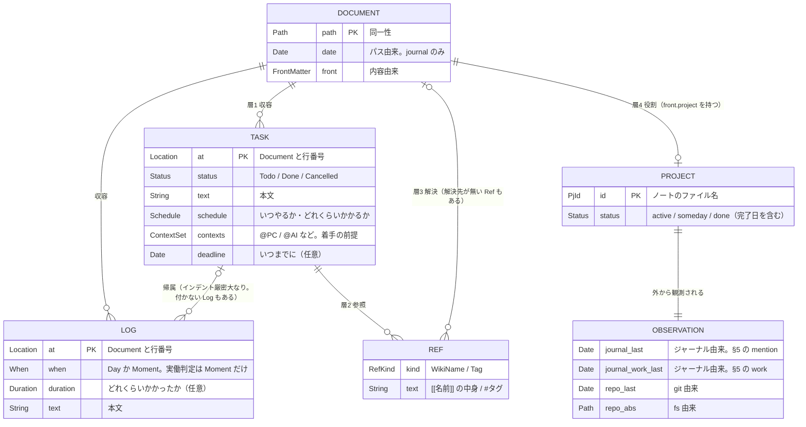

# taski ドメインモデル

本ドキュメントは taski のドメインに **何があり、どう関係するか** を記述する。

- **[requirements.md](requirements.md)** — *何を* 満たすか（要求）
- **[architecture.md](architecture.md)** — *どこに* 置くか（クレート構成・パイプライン・ビルド）
- **[syntax.md](syntax.md)** — *どう書くか*（記法。文書・行・行内）
- **[design.md](design.md)** — *どう表しているか*（現状の型・走査・不変条件・写像）
- **本ドキュメント** — *何が何であるか*（概念・関係・導出）

**本ドキュメントは目標形である。** 現状の Rust の型はここと 1 対 1 に対応しておらず、差分は design.md の移行課題（G-1〜G-12）に列挙してある。本ドキュメントの記述と実装が食い違う箇所には、必ず対応する G-* がある。実装より先に「何が何であるか」を固定するために分けて置いている。

**表層構文と走査手順はドメインではない。** 「Task をどう書くか」（記法）は [syntax.md](syntax.md) の、「行をどう読むか」（走査の状態機械）は design.md §4 の担当で、ここでは「Task が何であるか」だけを書く。行末の括弧やセクション見出しといった*場所*で概念を定義しない、というのが本ドキュメントの一貫した立場である。

要求の根拠（なぜその仕様なのか）は requirements.md 側にある。

## 1. エンティティ

実体は `Document` / `Task` / `Log` の 3 つで、それらを結ぶのが参照 `Ref` である。`Project` は独立した実体ではなく `Document` の役割（§2）、`Observation` は保存されない導出値（§5）なので、この章には現れない。`Date` は `YYYY-MM-DD` の暦日、`Time` は `HH:MM`、`Line` は行番号。各語の現状の Rust 表現は design.md §2 にまとめてある。

```
Document                          -- md ファイル 1 つ。一次情報はすべてここにある
  ├ path  : Path                  -- 同一性
  ├ date  : Option<Date>          -- パスから決まる（journal/<Y>/<M>/<YYYY-MM-DD>.md）
  ├ front : Option<FrontMatter>   -- 内容から決まる
  └ text  : String                -- 本文

When                              -- いつ。粒度が 2 段階ある
  = Day(Date)                     -- 日付だけ決まっている
  | Moment(Date, Time)            -- その日の中の時刻まで決まっている
    date(w) : Date                -- どちらの場合も日付は取り出せる

Duration                          -- どれくらいかかるか（「45分」「2時間」）

Schedule                          -- いつ・どれくらい。少なくとも一方を持つ
  ├ when     : Option<When>
  └ duration : Option<Duration>

Context = String                  -- @ に続く文字列。閉じた集合ではない

Task                              -- Document 内のチェックボックス行
  ├ at       : (Document, Line)   -- 同一性。どの Document に収容されているかを含む
  ├ status   : Todo | Done | Cancelled
  ├ text     : String
  ├ refs     : Set<Ref>           -- refs(text)。§3。Task は Project を知らない
  ├ schedule : Option<Schedule>   -- いつやるか・どれくらいかかるか
  ├ contexts : Set<Context>       -- 何が揃えば着手できるか
  └ deadline : Option<Date>       -- いつまでにやるか

Ref                               -- 文中に書かれた参照
  = WikiName(String)              -- [[名前]]
  | Tag(String)                   -- #タグ
    text(r) : String              -- どちらの場合も包んでいる文字列を取り出せる

refs(s) : Set<Ref>                -- テキスト s に書かれた Ref 全部。Task にも Document にも適用する

Log                               -- 起きたことの記録。文書のどこにでも書ける
  ├ at       : (Document, Line)
  ├ when     : When               -- いつ起きたか。必ず持つ
  ├ duration : Option<Duration>   -- どれくらいかかったか
  └ text     : String

Tasks(d) : Set<Task>              -- Document d に収容された Task 全部（層 1 の逆向き。§3）
Logs(d)  : Set<Log>               -- 同じく Log 全部
```

**「いつ」と「どれくらい」は独立した 2 つの軸である。** 書きたいものは 3 通りあり、どれも書けなければならない — 日付のみ（`Day`）、日付とその日の中の時刻（`Moment`）、かかる長さ（`Duration`）。

この形にすると 3 つのことが同時に片付く。

| | 現状 | `When` / `Duration` にすると |
| --- | --- | --- |
| 粒度 | `date: String` + `time: Option<Time>` の 2 フィールド。「日付だけ」と「時刻まで」の区別が `Option` の有無に潰れている | 直和なので粒度が構造に現れ、判別が全域になる |
| 開始終了 | `10:00-11:00` を `time` / `end_time` の 2 フィールドで持つ | `Moment(d, 10:00)` + `Duration(60分)` の**表記**にすぎない。`end_time` は導出値（`when + duration`） |
| 所要時間 | 判断メタデータの `（45分）` とログの開始終了に**同じものが 2 箇所**ある。前者はスケジュールに使われず、後者は `list` に出ない | `Duration` 1 つ |

**Task が自分の `when` を持つことが、計画と実績の分離である。** Task が予定の時刻を持たなければ、予定を入れるには配下に Log を書くしかなく、`Log` が「予定の枠」と「起きた時刻」を兼ねてしまう。すると計画列と実績列が同じ時刻セルに乗り、「10:00-11:00 の予定が実際は 10:15-11:20 だった」というずれを表現できない（現状がこの形である — design.md G-11）。

**「判断メタデータ」という概念は無い。** `（45分・@PC）` は行末の括弧に属性を並べて書く**記法**であって、ドメインの概念ではない（判定規則は syntax.md §5.3、実装は design.md §5.4、目標形では配下の属性行に置き換わる — syntax.md §10）。括弧という*場所*で定義された概念は、セクションで定義された `next_action` / `backlog`（§2）と同じ category error である。

Task が持つべき計画上の属性は 3 つである。

| 属性 | 何を表すか | 現在の書き方 |
| --- | --- | --- |
| `schedule` | **いつやるか・どれくらいかかるか。** `when` は日だけ（`Day`）と時刻まで（`Moment`）の 2 段階 | 所要時間は `45分`。いつやるかは配下の日付行（design.md G-11） |
| `contexts` | **何が揃えば着手できるか。** ユーザーが自由に増やせるので閉じた集合ではない | `@PC` `@AI` `@家` |
| `deadline` | **いつまでにやるか。** `schedule` とは別の軸である（いつやるかと、いつまでにやるか） | `08-15` `締切08-15` |

**この 3 つをどう書くかは syntax.md §10 が定める。** タスクの配下に `- 予定: 2026-08-01 10:00` のようなキー付きの行を置く形で、3 属性はそれぞれ独立した行になる。行末の括弧に要素を並べる現行の書き方（syntax.md §5.3）は置き換わる。

`schedule` の 2 つの成分はどちらも任意である。「45 分かかるが、いつやるかは未定」も「8/1 にやるが、どれくらいかは未定」も普通に書きたい。両方とも無いなら `schedule` を持たない。

**重さ（`軽` / `重`）は持たない。** 現状の `is_meta_element` は認識するが、ドメインの属性にはしない。

**属性は分解した形で持つ。** 「メタデータらしいか」を判定して文字列のまま返すのでは、利用側が同じ区切りでもう一度分割することになり、所要時間も締切も値として扱えない。3 つを属性にするのは整理ではなく機能の追加である（現状との差は design.md G-12）。

**Task の `when` は日付を明示的に書く。** `Document.date` から暗黙に補わない。補うことにすると、PJ ノートに書いた予定が日付を持てなくなる。

Log は例外で、ジャーナルのトップレベル時刻メモ（`- HH:MM: 本文`）だけが日付を `# YYYY-MM-DD` 見出しから受け取る。これは記法上の省略であって、できあがる `Log.when` は日付を含んだ `Moment` である（syntax.md §3.4）。

**Log の Task への帰属は関係であって、Log の属性ではない。**

```
attach(log) : Option<Task>        -- インデント厳密大なりで直前のタスクに付く（design.md §4）
```

帰属を持たない Log は例外ではなく、書かれた場所で 3 種類に分かれる。

| 帰属を持たない Log | 日付の出どころ | 何に使われるか |
| --- | --- | --- |
| PJ ノートの日付行 | 行に書かれた日付 | Project の履歴（§2 の `logs(pj)`） |
| ジャーナルのトップレベル時刻メモ（`- HH:MM: 本文`） | `# YYYY-MM-DD` 見出しから継承 | スケジュール |
| それ以外の位置に書かれた日付行 | 行に書かれた日付 | 何にも使われない |

**この形にすると `ScheduleEntry` の判別子問題（design.md W-3）が消える。** 現状は「タスク由来か時刻メモ由来か」を `task_text.is_empty()` で判別していて全域でないが、`attach(log)` は `Option` なので全域である。

**Document の性質は独立した 2 つの軸で決まる。**

| 軸 | 由来 | 与えるもの |
| --- | --- | --- |
| `date` | **パス**が `journal/**/<YYYY-MM-DD>.md` に一致するか | その Document に書かれた記録の既定の日付 |
| `front` | **内容**（先頭の YAML front matter） | PJ かどうか（§2）、`repo` / `completed` |

この 2 つを 1 つの直和（`Journal | Note | Other`）に潰してはならない。潰すと「`journal/` に置いたか」と「`project:` を書いたか」が同じ次元の判定に見えるが、前者はパスの規約、後者はファイルの中身であり、独立に決まる。

**`note/` は概念に登場しない。** 参照の作成先の既定（requirements.md 3.4）と、PJ ノートの探索範囲の既定（§4）というだけの規約であって、Document の種類ではない。

日付の由来はもう 1 つある — 文書内の `# YYYY-MM-DD` 見出し。これは Document の属性ではなく走査中の文脈であり、`Document.date` とは別物として扱う。ここから日付を受け取るのはトップレベル時刻メモだけである（前述）。

## 2. Project は Document の役割である

**Project が本質的に持つのは、同一性と関与の状態だけである。**

```
Project ⊂ Document
  条件: front.project ≠ None
  ├ id     : PjId = stem(path)                       -- 同一性（stem は §4）
  └ status : Active | Someday | Done(Option<Date>)   -- 関与の状態
```

Project は Document を所有する別の実体ではなく、**Document の部分集合**である。「ノートを持つ」のではなく「ノートである」。

`PjNote` / `PjProject` が持つ残りのフィールドは、すべて次の 3 つのどれかに落ちる。判定基準は**捨てて作り直せるか**である。

| 種別 | 作り直す元 | 変わる条件 | 例 |
| --- | --- | --- | --- |
| **射影** | ノート本文 | ノートを書き換えたとき | `tasks` `logs` `log_last` `health` |
| **観測の構成** | （宣言そのもの。どこを見に行くか） | ノートを書き換えたとき | `repo` |
| **観測** | 世界 | 世界が変わったとき | `updated` `repo_last` `journal_last` `ahead_count` |

作り直せないのは `id` と `status` だけで、それが Project の実体である。**front matter に `project:` と書く行為そのものが Project を作る**、と言い換えてもよい。

### `completed` は `status` の一部である

`completed` は `status = Done` のときだけ意味を持つ。独立したフィールドにすると `active` かつ `completed: 2026-01-01` という無意味な組み合わせが表現できてしまう。状態に畳めば構文的に排除できる（design.md G-9）。front matter の表記（`project:` と `completed:` の 2 キー）は変えず、読み取ったあとの型だけを畳む。

### `repo` は定義ではなく観測の構成である

`repo:` はノートに書かれるが、その意味は「git の観測をどこに向けるか」だけで、Project の性質を何も述べていない。`repo` を持たない Project は不完全なのではなく、**観測点を宣言していない**だけである。

この区別が `has_remote`（design.md §5.6）の設計の根拠になっている。`repo:` を持たない Project の `has_remote` が `false` ではなく `null` なのは、「remote が無い」という観測結果ではなく「観測していない」からである。

### セクションはドメインに属さない

射影はノート**全体**から実体を拾う。見出しで絞り込まない。

```
tasks(pj)  = Tasks(pj)                              -- ノート内の Task 全部（§1）
logs(pj)   = { l ∈ Logs(pj) | attach(l) = None }    -- 帰属しない Log 全部（§1）
```

`pj` に `Tasks` / `Logs` をそのまま適用できるのは、Project が Document だからである（`pj.note` のような所有関係は無い）。Project がこれらを**所有しているわけではない**。ノートという Document の中にある実体を指しているだけである。

**`## 次の予定` / `## オープンタスク` のようなセクションはドメインの構造ではない。** 人が文書を整理するための道具であり、モデルがその見出し文字列に依存してはならない。実体の判定は構文で決まる — `- [ ]` があれば Task、日付があれば Log。それ以外の行は自由記述であって、ドメインには現れない。

この帰結として、次の 2 つは概念から消える。

| 消えるもの | 理由 |
| --- | --- |
| `next_action` | 「これが次だ」という選択は人が `tasks(pj)` の中から行う。taski は候補を出すところまでを担い、選ばない（design.md P3） |
| `backlog` | Task でも Log でもない箇条書きは、モデル上どの実体でもない。「まだ実体になっていない意図」ではなく、単に自由記述である |

`health` は残るが、基盤が `next_action` から `tasks(pj)` に移る。

```
planned(t) = t.schedule ≠ None ∨ t.contexts ≠ ∅ ∨ t.deadline ≠ None    -- §1
todos(pj)  = { t ∈ tasks(pj) | t.status = Todo }

health(pj) = NoNext      ⟺ todos(pj) = ∅
           | Unclarified ⟺ todos(pj) ≠ ∅ ∧ ∀ t ∈ todos(pj). ¬planned(t)
           | Ok          ⟺ ∃ t ∈ todos(pj). planned(t)
```

計画上の属性は Task が持つので、`taski list` と `taski pj` は同じ抽出を共有する（design.md P4）。「次に何をするか決まっているか」という `health` の意味は変わらないが、属性が構造化されるぶん**何が決まっていないか**まで言えるようになる。`planned` をこの粗さのままにするかは未決である（design.md G-12）。

### 同一性はパスに依存する

`id` が `stem(path)`（§4）である以上、ノートをリネームすると別の Project になる。ジャーナルに残った `[[旧名]]` は解決先を失い、言及・実働の履歴が途切れる（design.md W-8）。

---

一方 `journal_last` / `repo_last` / `updated` / `ahead_count` は Project の性質ではない。**Project に対して外から行った観測**である。

```
Observation(pj) = ジャーナル由来（§5）∪ git 由来 ∪ ファイルシステム由来
```

出力型 `PjProject`（design.md §5.6）が持つ 5 つの層は、この区別に対応している。

| 層 | 概念 | 例 |
| --- | --- | --- |
| a | Project 本体（`id` / `status`）と射影 | `status` `tasks` `logs` `health` |
| b | Observation / fs | `repo_abs` |
| c | Observation / git | `updated` `repo_last` `ahead_count` `unreported` |
| d | Observation / ジャーナル | `journal_last` `journal_work_last` |
| e | 導出（`today` との差） | `stale_days` `log_days` `journal_days` |

現状の a 層にはこれに加えて `next_action` / `backlog` が含まれる。目標では消える（design.md G-10）。

`unreported` だけは層に収まりが悪い。`repo_last`（c）と `log_last`（a）の比較なので観測そのものではなく、`today` との差でもないので e でもない。出力上は c 層に置いてある（design.md §5.6）。

**定義と観測の分離は design.md P3（事実と判断を分ける）の 1 つ下の層にある規律である。** 定義はノートを書き換えれば変わる。観測は世界を見に行かないと変わらない。両者を 1 つの構造体に平坦化するのは出力の都合であって、概念としては別に扱う。

## 3. 関係の層 — Task は Project を知らない

**「Task が PJ に属する」は基本関係ではない。** Task が直接持つ関係は 2 つだけで、Project に届くのはそこから 2 段先である。

| 層 | 関係 | 意味 | 現状の実装 |
| --- | --- | --- | --- |
| 1 | Task → Document | **収容**。どの文書に書かれているか。`task.at` の一部であり、独立した関係ではなく同一性そのもの | `FileInput.file_uri` + `ParsedTask.line` |
| 2 | Task → Ref | **参照**。行から `[[名前]]` / `#タグ` を抽出する | `pj::collect_refs` |
| 3 | Ref → Document | **解決**。その名前がどの文書を指すか。解決先が無い `Ref` は普通にある（`#買い物`） | `wiki_link::resolve_wiki_link` と `refs.contains` の 2 系統（design.md G-5） |
| 4 | Document → Project | **役割**。`front.project` を持つか（§2） | `parse_front_matter` |

PJ 軸はこの合成として導出する。

```
docs(task)     = { task.at.0 } ∪ { d | r ∈ task.refs, resolve(r) = Some(d) }   -- 層 1・2・3
projects(task) = { d ∈ docs(task) | d ∈ Project }                              -- 層 4
```

`resolve` は §4 で定める解決関数で、ここでは探索範囲の引数を省いて書いている。

1 つの Task が複数の Project に属してよい（N:M）。

**層を分ける理由は、PJ を経由しないビューが実在するからである。** タグ別ビューは層 1・2 だけで成立する。

```
tags(task) = { text(r) | r ∈ task.refs, r は Tag } ∪ { match_key(stem(task.at.0.path)) }
```

これは `extract_tags` と `extract_file_tags` の和そのもので、Project の概念を一切要求しない（`stem` はファイル名から拡張子を落としたもの、`match_key` は空白を `_` に置換する照合キー — どちらも §4）。一方 `taski pj` は層 3・4 を通る。**両者が別世界を見ているように見えるのは、別の層の合成を見ているからであって、同じ概念が分裂しているからではない。**（実際に分裂しているのは層 3 だけ — design.md G-5）

**層をまたいだ依存を持ち込まない。** 現状の `extract_file_tags` は層 1 のタグ導出でありながら `project: active` を条件にしており、層 4 の情報を見ている。「どの PJ か」（事実）に「表示するか」（判断）が混入した形である。タグ導出は層 1・2 で完結させ、`status` による絞り込みは表示側の責務とする（design.md G-1）。

なお本ドキュメントで**「帰属」と呼ぶのは Log と Task の関係（§1・design.md §4）だけ**である。Task と Project の間にあるのは上の 4 層とその合成であって、帰属ではない。

Project ノートの中でどのセクションに書かれているかも、この層のどこにも現れない。セクションはドメインの構造ではないからである（§2）。

## 4. 同一性 — PjId と参照の解決

Project の正規名 `PjId` はノートのファイル名（拡張子を除いた stem）とする。参照は 2 つの表記で書かれる。

| 表記 | 例 | 空白 |
| --- | --- | --- |
| `[[名前]]` | `[[在庫 管理]]` | 書ける |
| `#タグ` | `#在庫_管理` | 書けない（`_` で代用する） |

したがって照合は正規形どうしの比較ではなく、**照合キー**を経由する。

```
stem(p)       = パス p のファイル名から拡張子を落としたもの
match_key(s)  = s の空白を "_" に置換したもの
hits(d, r)   ⟺ match_key(stem(d.path)) = match_key(text(r))   -- r : Ref。「r は d を指す」
```

`match_key` は単射ではない（`在庫 管理` と `在庫_管理` が衝突する）。これは `#タグ` に空白を書けないという記法の制約（syntax.md §6）から来る本質的な非可逆性なので、**衝突を禁止する側で解く**。すなわち探索範囲の中で `match_key` は一意でなければならない。こう決めると曖昧さが「黙って片方を採る」ではなく「入力が不正」として表面化する。

**参照の解決は 1 つの関数に集約する。** `hits` が名前レベルの原子で、`resolve` はその上に一意性を課しただけである。

```
resolve(ref, D) : Option<Document>        -- D は探索対象の Document 集合
resolve(r, D)   = D のうち hits(d, r) を満たす唯一の d（無ければ None）
```

Wiki リンクを開く時と PJ を照合する時で、同じ `resolve` を通す。Project かどうかは、解決した Document の `front` を見て決める。したがって「`r` が `pj` を指す」は `resolve` の言い換えでしかなく、**別の照合経路ではない。**

```
hits(pj, r) ⟺ resolve(r, D) = Some(pj)        -- pj ∈ Project ⊂ Document（§2）
```

以降 §5 で `hits(pj, …)` と書くのは、この同値による省略である。この形にすると「`note/` 直下にあるか」は概念から消え、探索範囲 `D` の設定という実装事項に退く（現状は 2 系統に分かれている — design.md G-5）。

## 5. 観測値の導出

ジャーナル由来の観測は、ジャーナルを直接読むのではなく **Task 集合からの導出**として定義する。

```
Journals    = { d ∈ Document | d.date ≠ None }
hits(pj, R) = ∃ r ∈ R. hits(pj, r)                                -- §4 の hits を集合に持ち上げたもの
max ∅       = ⊥                                                   -- 観測なし（出力では null）

mention(pj) = max { d.date | d ∈ Journals, hits(pj, refs(d.text)) }
work(pj)    = max { w      | d ∈ Journals, t ∈ Tasks(d), hits(pj, t.refs), w ∈ worked(t) }

logs(t)     = { l ∈ Log | attach(l) = Some(t) }                   -- §1
worked(t)   = { t.at.0.date | t.status = Done, t.at.0.date ≠ None }   -- 収容先 Document の日付
            ∪ { date(log.when) | log ∈ logs(t), log.when が Moment }
```

出力では `mention(pj)` が `journal_last`、`work(pj)` が `journal_work_last` になる（§2 の d 層）。

- `Day` のログは実働にしない（`Moment` だけを見る）。ジャーナルでは「やった記録」ではなく予定・メモとしても日付行が書かれるため。**ただしこの規則の根拠は、Task が `schedule` を持つと消える。** 予定が Task 側に移れば Log は常に記録になるので、`Day` を実働に含めるかどうかは改めて決めることになる（design.md G-11）。
- `max` を採る（走査順に依存させない）。時刻付きログは自分の日付を持つので、新しいジャーナルに前日ぶんを書き足せる。
- 観測範囲を `Journals` に限る。Project ノート自身に書かれた Log はここには入らない。あれは観測ではなく射影（§2 の `logs(pj)`）であり、別の道筋で拾う。

**両者の違いは `refs` を適用する対象だけで、そこから先の照合（層 3 の `resolve`）は同一である。** 言及は文書全体のテキスト（`refs(d.text)`）に、実働はタスク行（`t.refs` — 層 2 そのもの）に適用する。層 4（役割）はどちらの導出にも現れない — `pj` を与えるのは呼ぶ側であって、導出自身は解決先が Project かどうかを見ない。**層 1（収容）を使うのは実働だけ**で、完了タスクの日付を収容先 Document から取るためである。

**この定義のもとで「実働 ⊆ 言及」は定理になる。** タスク行は文書の一部なので `t.refs ⊆ refs(d.text)`、したがって `hits(pj, t.refs) ⟹ hits(pj, refs(d.text))`、すなわち `work(pj) ≠ ⊥ ⟹ mention(pj) ≠ ⊥`。集合の包含から従うだけで、PJ の概念も収容経路も出てこない。現状はこれを**規律**（両者で同じ `collect_refs` を呼ぶ）で守っており、破れうるので design.md I-17 に不変条件として書いてある。導出に直せば規律が不要になる（design.md G-4）。

## 6. 全体図



読み方:

- **`TASK` から `PROJECT` への辺は無い。** 層 2 → 3 → 4 を辿って初めて届く（§3）。タグ別ビューは層 1・2 で止まるので、`PROJECT` と `OBSERVATION` の箱を必要としない。
- **`LOG` の親は 2 つある。** 収容（必ず 1 つの `DOCUMENT` にある）と帰属（`TASK` に付くとは限らない）で、後者が `0..1` であることが重要である（§1）。PJ ノートに書かれた記録は帰属を持たない `LOG` で、`PROJECT` が所有しているのではなく、ノートという `DOCUMENT` に収容された `LOG` のうち帰属しないものを指しているだけである（§2）。
- **`REF` が `TASK` からしか生えていないのは、この図が層 2 を描いているからである。** §5 の言及（`mention`）はタスク行に限らず文書全体の `refs(d.text)` を見るので、自由記述に書かれた `[[名前]]` もそこに入る。`t.refs ⊆ refs(d.text)` という包含が「実働 ⊆ 言及」の根拠である（§5）。
- `PROJECT` の箱は独立したレコードではなく **`DOCUMENT` の役割**である（§2）。`DOCUMENT → PROJECT` が `0..1` なのはそのためで、層 3 の解決先として戻ってくる辺も、`PROJECT` の箱ではなく `DOCUMENT` に着く。
- **`PROJECT` が 2 属性しか持たないことが重要である**（§2）。`next_action` や `backlog` が無いのは省略ではなく、セクション名に依存する射影をドメインから外した結果である。`tasks(pj)` / `logs(pj)` は図の上では `DOCUMENT → TASK` / `DOCUMENT → LOG` の辺をそのまま辿るだけで、`PROJECT` から生える辺は無い。
- `OBSERVATION` も保存される実体ではなく、実行のたびに世界を見て作られる値である。`PROJECT` とは「概念としては別だが、出力では 1 つの構造体に平坦化される」関係にある。
